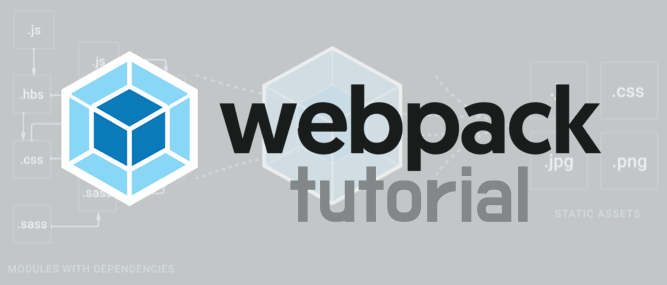

# Webpack2 Tutorial  
This repository is a tutorial repository provided for beginner who start webpack2.
_This tutorial is based on webpack of [version 2.5.0 release](https://github.com/webpack/webpack/releases)_.
A description of the `webpack.config.js` file is posted on the [blog](https://jaeyeophan.github.io/).

`Webpack version 2.5.0` 기준으로 tutorial을 진행할 수 있는 Repository입니다.

## Usage
#### First, Check the branch!
(Following lists are linked each branch)  
이 Repository의 branch를 확인해주세요. branch에 따라 **Tutorial Step**이 나누어져 있습니다.  
다음 리스트는 **branch에 링크** 되어있습니다.
1. [Step 1. 기본 설정들에 대해서 알아봅니다.](https://github.com/JaeYeopHan/webpack2_tutorial/tree/Step-1)
2. [Step 2. 각종 플러그인에 대해서 알아봅니다.](https://github.com/JaeYeopHan/webpack2_tutorial/tree/Step-2)
3. [Step 3. Webpack의 추가적인 기능들](https://github.com/JaeYeopHan/webpack2_tutorial/tree/Step-3)
4. [Step 4. Seperate dev and prod environment]
5. [Step 5. Test Runner, Test framework integration]
6. [Step 6. 성능, Tree Shaking]

* [SpringBoot + Webpack2 Scaffolding](https://github.com/JaeYeopHan/Springboot_webpack2)
* [React-Express + Webpack2 Scaffolding](https://github.com/JaeYeopHan/Express_react_scaffolding)

#### or fork this repository and enjoy webpack!

## Installation
```bash
# If node is not installed in your local,
$ brew install node 
```
and,
````bash
$ mkdir webpack2_tutorial_dir
$ cd webpack2_tutorial_dir
$ git clone https://github.com/JaeYeopHan/webpack2_tutorial
$ cd webpack2_tutorial
$ npm install
````

## References
[Webpack Official Documents](https://webpack.js.org/concepts/)  
[Webpack Tutorial translated by arahansa](https://github.com/AriaFallah/WebpackTutorial/tree/master/ko-arahansa)  
[Webpack2와 모듈 번들링을 위한 초보자 가이드](https://github.com/FEDevelopers/tech.description/wiki/Webpack2%EC%99%80-%EB%AA%A8%EB%93%88%EB%B2%88%EB%93%A4%EB%A7%81%EC%9D%84-%EC%9C%84%ED%95%9C-%EC%B4%88%EB%B3%B4%EC%9E%90-%EA%B0%80%EC%9D%B4%EB%93%9C)  
[오늘도 끄적끄적 블로그](https://perfectacle.github.io/categories/Front-end/Node-js/)  
[webpack2 입분 가이드-DailyEngineering](https://hyunseob.github.io/2017/03/21/webpack2-beginners-guide/)  
[webpack2 시작하기-dev-momo](http://dev-momo.tistory.com/entry/Webpack2-%EC%8B%9C%EC%9E%91%ED%95%98%EA%B8%B0)  

## Contribution
You're free to contribute to this project by submitting [issues](https://github.com/JaeYeopHan/webpack2_tutorial/issues) and/or [pull requests](https://github.com/JaeYeopHan/webpack2_tutorial/pulls).  
자유롭게 issue를 남겨주시거나 Pull Request를 등록해주세요.

## LICENSE
<a rel="license" href="http://creativecommons.org/licenses/by/4.0/"></a>
